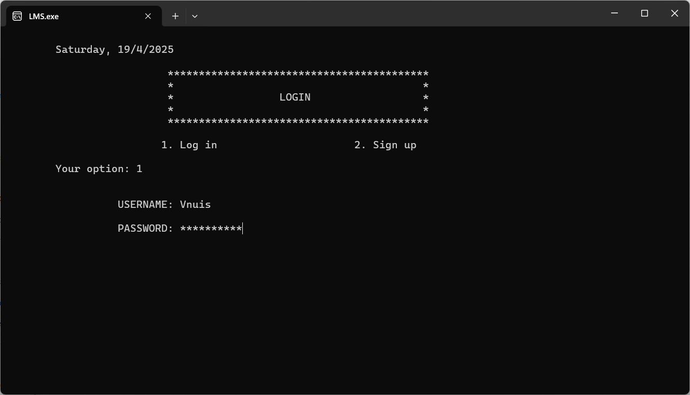
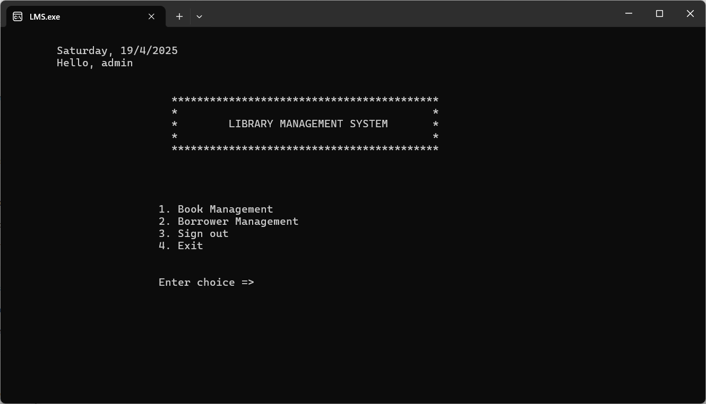
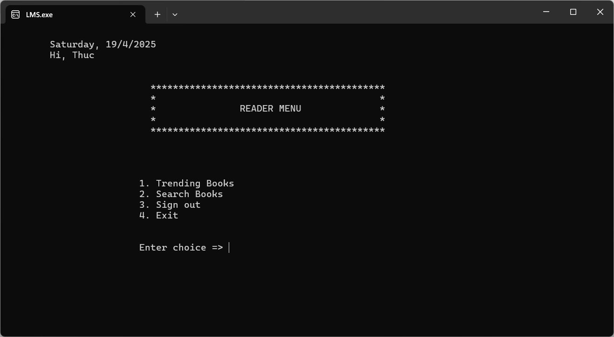

# Library Management System (C)

A console-based Library Management System written in C for managing book records and borrower information. This project was developed as the final project for the Programming I course (INS2020) at VNU International School.

## Description

This application provides a simple command-line interface for librarians (administrators) and readers (users) to interact with a library database. Administrators can manage the book inventory and track borrowed books, while readers can search for books and view popular titles. The system uses text files (`book.txt`, `record.txt`, `account.txt`) for persistent data storage.

## Features

### Administrator Functions
*   Secure login.
*   **Book Management:**
    *   Add new book records (ID, name, author, category, location, price, available quantity).
    *   Modify existing book details.
    *   Search books by ID, name, category, author, or price.
    *   Delete book records.
*   **Borrower Management:**
    *   Add new borrowing records (student name, student ID, book name, book ID, borrow date, return date).
    *   Modify existing borrowing record details.
    *   Search borrowing records by student ID, student name, or book ID.
    *   Search for outdated borrowing records.
    *   Delete borrowing records.
*   Sign out / Exit.

### Reader Functions
*   Secure login or Sign up for a new account.
*   Search books by ID, name, category, author, or price.
*   View trending books (based on view count).
*   Sign out / Exit.

## Getting Started

### Prerequisites
*   A C compiler (like GCC, MinGW, or the compiler integrated into an IDE like Visual Studio or Code::Blocks).
*   Windows Operating System (if using the `MessageBox` feature as-is).

### How to use
1.  Clone the repository:
    ```bash
    git clone https://github.com/duythucvnu/vnuis-lms-c.git
    cd vnuis-lms-c
    ```

2.  Execute the compiled file from your terminal:
    ```bash
    ./lms.exe
    ```
    or on Windows command prompt:
    ```cmd
    lms.exe
    ```
3.  The application uses the following data files in the same directory:
    *   `account.txt`: Stores user login credentials.
    *   `book.txt`: Stores book inventory details.
    *   `record.txt`: Stores borrowing records.
    The program will create these files if they don't exist.

### Default Administrator Account
*   **Username:** `Vnuis`
*   **Password:** `Vnu.edu.vn`

## Screenshots


### Login Screen


### Administrator Menu


### Reader Menu


## License

This project was created for educational purposes as part of the Programming I course at VNU-IS.
